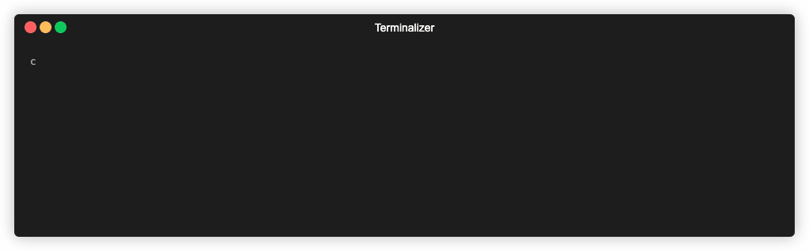

# CLS - an "ls" clone using Node.js

cls is a "ls" clone that uses node inbuilt functions to read a directory and colour code the results.

## Features

- Custom Theming in colorsettings.json
- Fancy async promise based format

## Download

1) Clone this repository `git clone https://github.com/burstMembrane/cls.git`
2) install dependencies `npm install`
3) make app.js executable `chmod +x app.js`
4) link with npm `npm link`
5) run command with or without args e.g `cls` or `cls ..`

## Requirements

[Colors.js](https://www.npmjs.com/package/colors)

## License
Distributed under the MIT License. See LICENSE for more information.

